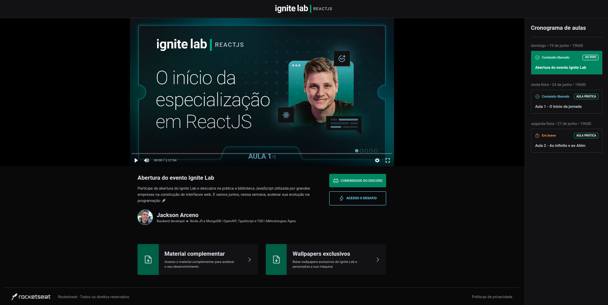

# Event Platform

  

### English

- Link to platform: https://event-platform-jacksonfa.vercel.app/

Projects developed during Rocketseat's Ignite Lab week, to acquire a little more in-depth knowledge about React.
It's a platform for video content, similar to Ignite Lab's own platform.

By accessing the platform, the user can register by informing their name and email, beign redirected to the main screen of the event.
On the event page, the user can view in the sidebar on the right, a list of available classes and those yes to be released, with some sumarized information about each class.

When selecting an available class, it's content is loaded in the main part of the screen, containing the video player, class description and other resources and information.
A CMS panel was used to store and provide data to the application.

#### Technologies:
- React with Vite;
- Typescript;
- TailwindCSS;
- React Router DOM;
- Vime;
- GraphQL;
- GraphQL CodeGen;
- Apollo Client;
- GraphCMS;

##
### Português

- Link para acessar a plataforma: https://event-platform-jacksonfa.vercel.app/

Projeto desenvolvido durante a semana do Ignite Lab da Rocketseat, para adquirir conhecimento um pouco mais aprofundado sobre o React.
Trata-se de uma plataforma para conteúdos em vídeo, semelhante à própria plataforma do Ignite Lab inclusive.

Acessando a plataforma o usuário consegue se cadastrar informando nome e email, sendo redirecionado para a tela principal do evento.
Na página do evento o usuário pode visualizar na sidebar à direita, uma lista de aulas disponíveis e as que ainda serão lançadas, com algumas informações resumidas sobre cada aula.

Ao selecionar uma aula disponível, o conteúdo da mesma é carregado na parte principal da tela, contendo o player do vídeo, descrição da aula e demais recursos e informações.
Foi utilizado um painel CMS para armazenar e prover dados para aplicação.

#### Técnologias:
- React com Vite;
- Typescript;
- TailwindCSS;
- React Router DOM;
- Vime;
- GraphQL;
- GraphQL CodeGen;
- Apollo Client;
- GraphCMS;
